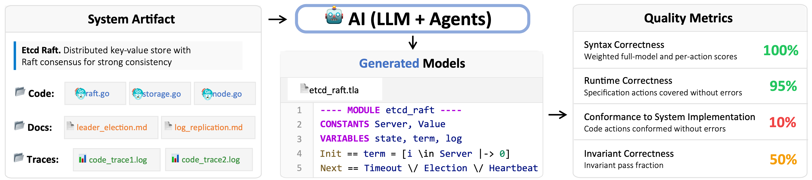

# SysMoBench: Evaluating AI on Formally Modeling Complex Real-World Systems

[](https://arxiv.org/abs/2509.23130)
[](https://openreview.net/forum?id=SAeaTz8YoM)
[](https://sysmobench.com)

> **News**: "**SysMoBench: Evaluating AI on Formally Modeling Complex Real-World Systems**" has been accepted to **ICLR 2026**. Project site: [sysmobench.com](https://sysmobench.com).

## Overview

Formal models specify large, complex systems and verify their correctness, but are notoriously expensive to write. Generative AI shows promise for producing certain specifications, yet existing work mostly targets small code, not complete systems. It is unclear whether AI can deal with realistic system artifacts, which requires abstracting complex behavioral properties into formal models.

SysMoBench evaluates AI's ability to formally model real-world concurrent and distributed systems. We use TLA+, the de facto specification language for these domains, and automate four kinds of metric: **syntax**, **runtime**, **conformance to implementation** (action-window verification, "WV"), and **invariant correctness**.



## Key features

- **4-phase automated scoring** — syntax (SANY), runtime (TLC), Phase-3 conformance via per-action WV against real system traces, Phase-4 invariant verification with expert templates.
- **11 real-world systems** — concurrent synchronization (Asterinas spinlock/mutex/rwmutex, ringbuffer), distributed consensus (etcd Raft, Redis Raft, Xline CURP, ZooKeeper), and PGo-compiled systems (dqueue, locksvc, raftkvs).
- **Agent-driven Phase 3** — WV is run by an evaluator agent (Claude Code or Codex) per the `wv-eval` skill, so each generated spec is judged on its own action mapping.
- **Spec repair** — `spec-repair` skill applies bounded edits to broken specs so P3/P4 can still be measured on a comparable model.

## Quick start

### Prerequisites

- Python 3.8+
- Java 11+ (for TLA+ tools)

### Setup

```bash
git clone https://github.com/specula-org/SysMoBench.git
cd SysMoBench
pip install -e .
sysmobench-setup           # download tla2tools.jar
export ANTHROPIC_API_KEY=...   # or OPENAI_API_KEY / GEMINI_API_KEY etc.
sysmobench --list-tasks
```

### Single-cell run

```bash
sysmobench --task spin --method direct_call --model claude --metric compilation_check
```

Single-cell results land under `output/<metric>/<task>/<method>_<model>/<timestamp>/`.

For batch evaluation, the WV pipeline, the spec-repair flow, and the leaderboard build, see the **[Usage Guide](docs/Usage.md)**.

## Tasks

11 system artifacts. Run `sysmobench --list-tasks` for the live list.

| System | Type |
|---|---|
| `spin`, `mutex`, `rwmutex` | Asterinas OS synchronization |
| `ringbuffer` | concurrent queue |
| `etcd`, `redisraft` | Raft consensus |
| `curp` | Xline CURP replication |
| `zookeeper` | distributed coordination |
| `dqueue`, `locksvc`, `raftkvs` | PGo-compiled systems |

## Metrics

| Phase | Metric | Tool |
|---|---|---|
| 1 — Syntax | `compilation_check`, `action_decomposition` | SANY |
| 2 — Runtime | `runtime_check`, `coverage`, `runtime_coverage` | TLC |
| 3 — Conformance | Window verification (WV) | Agent + TLC over (pre, post)-state windows |
| 4 — Invariant | `invariant_verification` | TLC + agent-translated invariants |

`sysmobench --list-metrics` enumerates all metric names.

> **Canonical phase weights**: P1 = 0.15, P2 = 0.15, P3 = 0.35, P4 = 0.35.

## Leaderboard

Scored data under [`docs/leaderboard/`](docs/leaderboard/) feeds the website at [sysmobench.com](https://sysmobench.com).

> **TODO** (paper-reproduce runbook): walk through `scripts/build_leaderboard.py` → `scripts/batch_repair_and_wv.py` → `scripts/build_leaderboard_repaired.py`.

## Adding a new system

`tla_eval/tasks/<task>/task.yaml` declares the system; prompts go under `tla_eval/tasks/<task>/prompts/`; invariant templates live at `data/invariant_templates/<task>/`; the WV harness is bootstrapped via the `harness-gen` skill into `artifacts/<task>/`.

See [Adding a New System](docs/add_new_system.md) for the step-by-step.

## Project layout

```
SysMoBench/
├── scripts/                      # CLI entry points and batch orchestrators
│   ├── run_benchmark.py          # single-cell runner (wired as `sysmobench`)
│   ├── run_batch_experiment.py   # full P1→P4 batch
│   ├── launch_wv_eval.sh         # Phase 3 (WV) launcher
│   ├── batch_repair_and_wv.py    # spec-repair + WV orchestrator
│   └── build_leaderboard*.py     # CSV/JSON leaderboard builders
├── tla_eval/
│   ├── tasks/                    # task.yaml + prompts/ for each of the 11 systems
│   ├── methods/                  # generation methods (currently: direct_call)
│   ├── models/                   # LiteLLM-based model adapters
│   ├── evaluation/               # P1, P2, P4 evaluators
│   ├── wv_tools/                 # WV runner helpers
│   └── skills/                   # agent skills (harness-gen, wv-eval, spec-repair)
├── data/
│   ├── invariant_templates/      # P4 expert invariants per system
│   ├── patches/                  # trace-instrumentation patches per system
│   └── sys_traces/               # captured system traces (per task contract)
├── docs/
│   ├── Usage.md                  # full usage guide
│   ├── add_new_system.md         # extension how-to
│   └── leaderboard/              # scored data + CSV/JSON snapshots
└── tools/
    └── submit_spec/              # MCP server for agent-style submission flow
```

## Citation

```bibtex
@inproceedings{cheng2026sysmobench,
  title  = {SysMoBench: Evaluating AI on Formally Modeling Complex Real-World Systems},
  author = {Cheng, Qian and others},
  booktitle = {ICLR},
  year   = {2026}
}
```

> **TODO**: confirm full author list and final BibTeX once camera-ready is fixed.

## License

> **TODO**: pick and add a LICENSE file.
