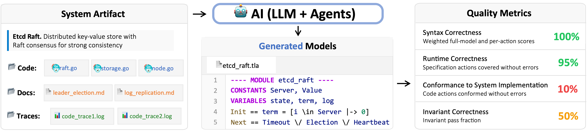
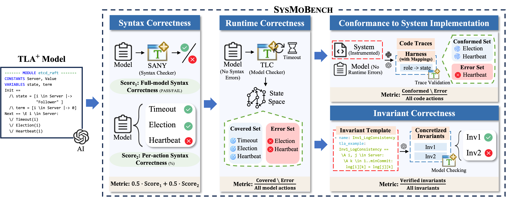

# SysMoBench: Evaluating AI on Formally Modeling Complex Real-World Systems

## Overview


*Figure: SysMoBench sources its tasks from real-world systems and automatically evaluates AI-generated TLA+ models with different metrics.*

Formal models are essential to specifying large, complex computer systems and verifying their correctness, but are notoriously expensive to write and maintain. Recent advances in generative AI show promise in generating certain forms of specifications. However, existing work mostly targets small code, not complete systems. It is unclear whether AI can deal with realistic system artifacts, as this requires abstracting their complex behavioral properties into formal models.

SysMoBench presents a benchmark that evaluates AI's ability to formally model large, complex systems. We focus on concurrent and distributed systems, which are keystones of today's critical computing infrastructures, encompassing operating systems and cloud infrastructure. We use TLA+, the de facto specification language for concurrent and distributed systems, though the benchmark can be extended to other specification languages.

We address the primary challenge of evaluating AI-generated models by automating metrics like syntactic and runtime correctness, conformance to system code, and invariant correctness. SysMoBench currently includes nine diverse system artifacts: the Raft implementation of Etcd and Redis, the Spinlock and Mutex in Asterinas OS, etc.; more artifacts are being actively added.

## Key Features

- **Automated Quality Metrics**: Four automated metrics evaluate AI-generated models from multiple dimensions: syntax correctness (SANY-based validation), runtime correctness (TLC model checking), conformance to system implementation (trace validation), and invariant correctness (safety and liveness properties verification).

- **Real-World System Artifacts**: Nine diverse systems from production environments, including distributed consensus protocols (Etcd Raft, Redis Raft), concurrent synchronization primitives (Asterinas Spinlock/Mutex/Rwmutex), distributed replication systems (Xline CURP), and PGo-compiled systems.

- **Extensible Framework**: Adding new system artifacts requires no reference model—only system code, instrumentation for trace collection, and invariant templates, making the benchmark easy to extend with additional systems.

## Installation

### Prerequisites

[TODO: List environment requirements]
- Python 3.8+
- Java 11+ (for TLA+ tools: SANY and TLC)
- [TODO: Other dependencies]

### Local Installation

```bash
# TODO: Complete installation steps
```


## Quick Start

### Running Your First Evaluation

This example demonstrates how to evaluate an AI-generated TLA+ model for the Asterinas Spinlock system using syntax correctness metric.

[TODO]


**Expected Output:**

```
[TODO: Example output]
```

## Benchmark Tasks

SysMoBench includes 9 diverse real-world system artifacts from concurrent and distributed systems:

[TODO: Convert Table 1 to Markdown table]

## Evaluation Metrics

SysMoBench provides four automated phases to evaluate AI-generated TLA+ models from different dimensions:


*Figure: SysMoBench metrics and evaluation workflow. The benchmark evaluates syntax correctness, runtime correctness, conformance to system implementation, and invariant correctness.*

### 1. Syntax Correctness

[TODO:
- 1-2 sentences explaining what this metric measures
- Tool used: SANY Syntactic Analyzer
- Scoring method: weighted score (0.5 * full-model + 0.5 * per-action)]

**Running syntax evaluation:**

```bash
# TODO: Command example
```

### 2. Runtime Correctness

[TODO:
- 1-2 sentences explaining what this metric measures
- Tool used: TLC Model Checker
- Scoring method: covered actions without errors / total actions]

**Running runtime evaluation:**

```bash
# TODO: Command example
```

### 3. Conformance to System Implementation

[TODO:
- 1-2 sentences explaining what this metric measures
- Method: trace validation
- Scoring method: code actions covered without errors / total code actions]

**Running conformance evaluation:**

```bash
# TODO: Command example
```

### 4. Invariant Correctness

[TODO:
- 1-2 sentences explaining what this metric measures
- Method: model checking against system-specific invariants
- Scoring method: passed invariants / total invariants]

**Running invariant evaluation:**

```bash
# TODO: Command example
```

## Adding New Systems

SysMoBench is designed to be extensible. To add a new system artifact:

[TODO: High-level step overview, one sentence per step]

For detailed instructions, see [Adding New Systems Guide](docs/guides/adding_systems.md).


## Project Structure

```
LLM_Gen_TLA_benchmark_framework/
├── scripts/
│   └── run_benchmark.py          # Main entry script for running benchmarks
├── tla_eval/
│   ├── tasks/                    # Task definitions for each system artifact
│   │   ├── spin/                 # Spinlock task with prompts, configs
│   │   │   ├── prompts/          # System-specific prompt templates
│   │   │   └── task.yaml         # Task configuration (system info)
│   │   ├── mutex/
│   │   └── ...
│   ├── models/                   # LLM model interfaces and wrappers
│   ├── evaluation/               # Evaluator implementations organized by metric type
│   └── config.py                 # Configuration management (API keys, model endpoints)
├── data/
│   ├── invariant_templates/      # Expert-written invariant templates for each system
│   └── traces/                   # System execution traces for conformance evaluation
└── lib/                          # TLA+ toolchain (tla2tools.jar for SANY and TLC)
```


## License

[TODO: MIT/Apache 2.0]

---

